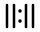

# XI:XI brand assets

The identity is built around four balanced vertical strokes: two stylized `XI` pairs with a centered point. The point is the alignment moment in `11:11`; the equal-height strokes communicate precision, balance, and synchronicity.

## Logo assets

- `assets/logo-wordmark.svg` — desktop wordmark, `176 × 32` viewBox.
- `assets/logo-mark.svg` — compact mobile mark, `32 × 32` viewBox.
- `favicon.svg` — square application icon using the same geometry.
- `assets/brand.css` — shared tokens, lockup sizing, dark-surface variants, and alignment accents.

## Usage

```html
<link rel="stylesheet" href="assets/brand.css">
<a class="brand-lockup" href="index.html" aria-label="XI:XI home">
  
</a>
<a class="brand-lockup brand-lockup--compact" href="index.html" aria-label="XI:XI home">
  
</a>
```

For dark sections, add `brand-lockup--on-dark`. Keep the mark at its native ratio and use the `--brand-*` tokens for color, spacing, rules, and accents. The SVGs use `currentColor` so they can be recolored without editing vector paths.
